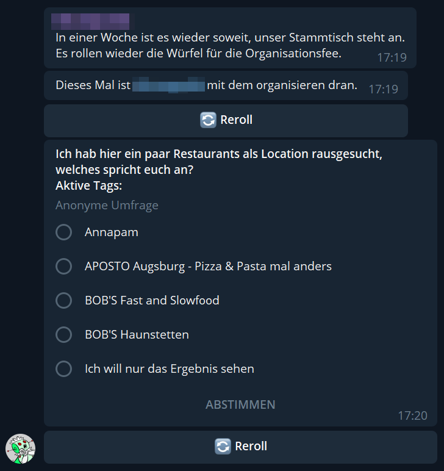
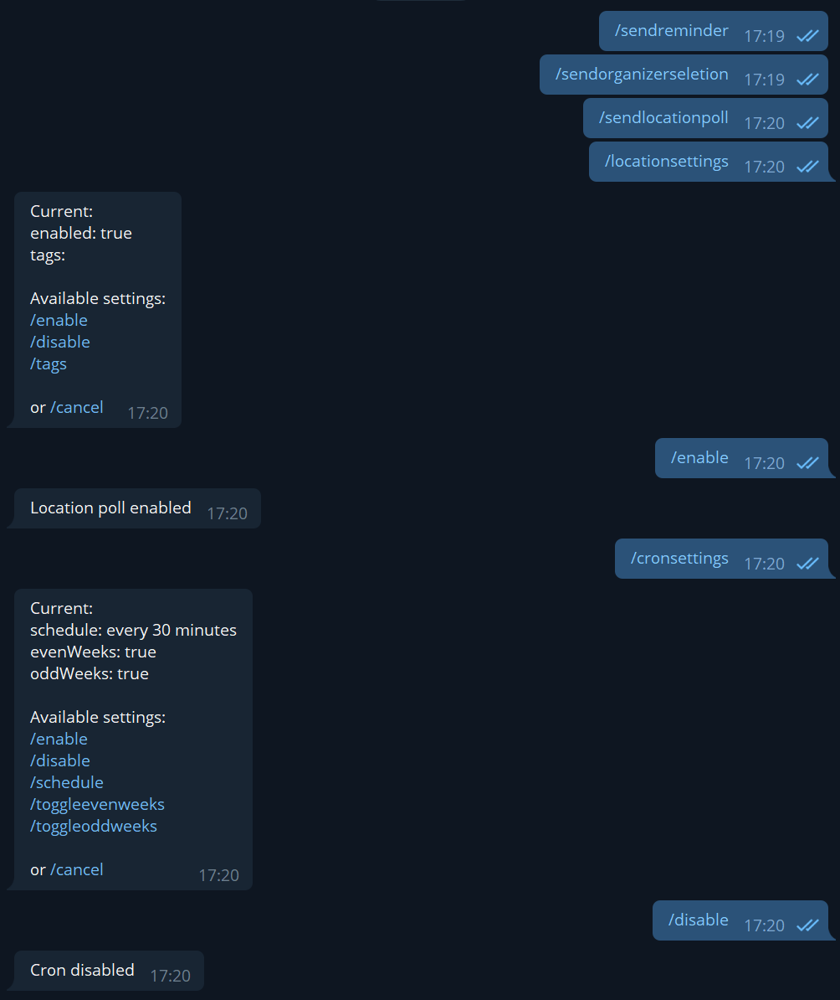

# Rosie - A Telegram meetup organisation bot

This Telegram bot reminds a group at a specific time about a future meeting and its preparations. It's configured with a yaml file and over bot commands.

## Features

* Sends a reminder message on a specified interval to a telegram group
* Selects one of the group members to do the planing and reservations.
* Opens a poll with random selected locations from a google sheet.
* Admin commands via private chat to trigger messages or change the config.

## Screenshot




## Config

Example config:

```yaml
telegramBotToken: <api-key>
telegramBotUsername: rosie
managingGroup: 12345678
adminIds:
  - 12345678
cron:
  schedule: "every minute"
  onEvenWeeks: true
  onOddWeeks: true
  enabled: true
locationPoll:
  enabled: true
  googleCredentialPath: "credentials.json"
  sheetId: "123456789ABCDEFGHIJKLMNOP"
  namesArea: "A1:A100"
  tagsArea: "B1:B100"
  locationsAmount: 4
  filterTags: [ ]
  reminderVoterPercentage: 0.6
knownUsers: { }
```

### `telegramBotToken`

The telegram bot api key.

### `telegramBotUsername`

The telegram bot username with out the '@'.

### `managingGroup`

The group_id the bot should post its messages. Remember to add the bot there as a member.

### `adminIds`

This list hold a list of admins which can control bot features and retrieve error messages.

### `cron` > `schedule`

The expression for the schedule. For more about the format look [here](https://github.com/shyiko/skedule).

### `cron` > `onEvenWeeks`

Enable the scheduler on even week numbers.

### `cron` > `onOddWeeks`

Enable the scheduler on odd week numbers.

### `cron` > `enabled`

Enable or disable the scheduler. When disabled the bot will not post any scheduled message.

### `locationPoll` > `enabled`

Enable or disable the location poll messages.

### `locationPoll` > `googleCredentialPath`

The file name of the `credentials.json` file for your google service account. It needs to be placed in the config folder.

### `locationPoll` > `sheetId`

This is the id of your google table sheet which should be accessed. Your service account needs to be invited there. It can be retrieved from the url when opening it in your
browser.

### `locationPoll` > `namesArea`

This defines the area where the location names can be found. It's specified like `A3:A18`. For now only one column is supported.

### `locationPoll` > `tagsArea`

This defines the area where the location tags can be found. It's specified like `A3:A18`. For now only one column is supported. The order must be the same as the order of the
names.

### `locationPoll` > `locationAmount`

This set the amount of location options for the location poll.

### `locationPoll` > `filterTags`

The tags the poll generator should filter for. It can be also set via the bot.

### `locationPoll` > `reminderVoterPercentage`

A value between 0.0 - 1.0 which marks the threshold for a reminder when x percent of the people in the organisation group voted on the location. Set 0 to disable.

### `knownUsers`

This should be left empty on the first start. The bot will store the members of the given group here to get a pool of people to select the organizer.

## Dynamic Settings

Most of the settings of the config file can be changed in a private chat with the bot. The only requirement for it is, that your telegram id is included in the admin ids.

## Texts

All texts can be changed via the `messages.yaml` file beside the config file.

## Deployment

The path the the config folder can be set with the environment variable `CONFIG_FOLDER`. It defaults to the local directory. Make sure the folder exists and is writeable. A empty
config file will be generated there at first start.

For an easy startup of the java artifact the `start.sh` script on the deployment folder can be used. Just set the right version and it should start the bot.
